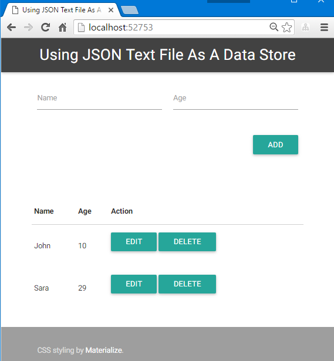

# Using JSON text file as a data store

    | JSON text file | RDBMS (like MySQL)
----|----------------|--------------------
Need Addtional Installation | :) Nothing | :( Need
Memory usage for small data | :) Enough low | :( use for RDBMS runtime
Memory usage for large data | :( Because on memory process | :) Can treat large data
Transactional/Atomic operation | :( No support | :) Rich support

### Screen shots

Running on Raspberry Pi Model B+ with Mono.

